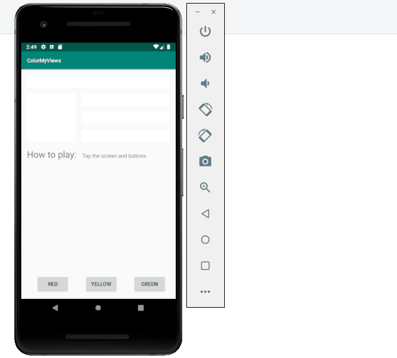

# ColorMyViews

An Android application based on Piet Mondrian artwork that allows you to color different boxes with screen taps.

Submitted by: Brianna Magnuson

Time spent: 1.5 - 2 hours

## User Stories

The following **required** functionality is complete:

* [x] Implement ConstraintLayout with manually defined constraints.
* [x] Use chaining to align TextViews.
* [x] Use baseline constraints to align text.
* [x] Change color of boxes and background by tapping screen and buttons.

The following **additional** features are implemented:

* [x] Maintain UI state when switching orientation from portrait to landscape.
* [ ] Replace TextViews with actual artwork.

## Video Walkthrough 

Here's a walkthrough of implemented user stories:

## Notes

Describe any challenges encountered while building the app.

"I have a slower computer, so my challenge was testing code to maintain the UI when the orientation is changed.
While testing different code my emulator would crash. Other than that, no challenges."

## License

Copyright 2019 Brianna Magnuson

Licensed under the Apache License, Version 2.0 (the "License");
you may not use this file except in compliance with the License.
You may obtain a copy of the License at

http://www.apache.org/licenses/LICENSE-2.0

Unless required by applicable law or agreed to in writing, software
distributed under the License is distributed on an "AS IS" BASIS,
WITHOUT WARRANTIES OR CONDITIONS OF ANY KIND, either express or implied.
See the License for the specific language governing permissions and
limitations under the License.
